# Notexa Minor Project Documentation

Project name: Notexa  
Project type: Full-stack collaborative note-taking system  
Stacks covered: Laravel backend, Next.js frontend, Flutter mobile app  
Documentation date: 2026-05-22

---

## 1. Abstract

Notexa is a full-stack collaborative note-taking platform that allows users to create rich notes, organize them, attach files, share notes with friends, redeem note share codes, view shared notes, and manage subscription-based storage. The system also includes an administrator panel for user management, note monitoring, payment review, plan management, application settings, SMTP testing, cloud storage configuration, and AI integration settings.

The project is implemented using three main applications:

- Backend API: Laravel, Sanctum authentication, database migrations, file storage services, payment service integration, and AI summary service.
- Web frontend: Next.js, React, Tailwind CSS, Axios API layer, TipTap rich text editor, user dashboard, and admin dashboard.
- Mobile app: Flutter, Provider state management, offline/local note support, cloud sync, file upload, PDF viewing, and authenticated mobile workflows.

The purpose of Notexa is to provide a practical, modern, cloud-ready note management application suitable for students, teams, and individual users who need structured notes, collaboration, and document attachments in one place.

---

## 2. Problem Statement

Many students and small teams use separate tools for notes, file storage, sharing, and collaboration. This creates fragmentation: notes may be stored in one place, files in another, shared links may become hard to track, and mobile access may be limited. Existing tools may also lack a simple project-friendly admin panel, subscription handling, or configurable integrations for storage, payments, and AI.

Notexa solves this by providing one integrated system where users can:

- Create and edit notes from web and mobile.
- Store rich note content and plain text search data.
- Share notes using friend-based permissions or share codes.
- Attach files and PDFs to notes.
- Use cloud sync from the mobile app.
- Access shared notes in a separate workspace.
- Manage subscription plans and storage limits.
- Allow administrators to control users, settings, payments, and plans.

---

## 3. Project Objectives

The main objectives of Notexa are:

- To build a secure note-taking platform with user registration, login, and token-based authentication.
- To provide rich note editing on the web using a modern editor.
- To provide mobile access with offline local note creation and cloud synchronization.
- To support collaboration through friends, note permissions, and share codes.
- To support file and PDF attachment workflows.
- To provide subscription plans for premium access and increased storage.
- To integrate configurable services such as R2/S3-compatible storage, SMTP email settings, API Nepal payment gateway, and DeepSeek AI summaries.
- To provide a complete admin dashboard for monitoring and managing the platform.
- To structure the codebase as a real-world full-stack application with separate frontend, backend, and mobile modules.

---

## 4. Scope

### 4.1 In Scope

- User registration and login.
- Sanctum token authentication.
- Profile update and password change.
- Create, read, update, delete, trash, restore, archive, and pin notes.
- Rich text note editing on web.
- Simple mobile text editing with local draft support.
- Local offline note storage in Flutter.
- Cloud synchronization from mobile.
- Share notes with friends using view/edit permissions.
- Redeem note share codes.
- File upload, download, delete, and PDF viewing.
- Subscription plans, payment initiation, payment history, and payment IPN handling.
- Admin dashboard for users, notes, payments, plans, settings, friendships, shared notes, and activity logs.
- AI note summary using DeepSeek when configured.
- Local or Cloudflare R2/S3-compatible file storage.

### 4.2 Out of Scope / Current Limitations

- Real-time multi-user editing is not implemented in the current code, although the backend has Pusher-related dependencies.
- Push notifications are not implemented.
- Advanced document version comparison is not implemented.
- Full automated test coverage is not yet complete.
- Mobile rich text editing is simpler than the web editor.
- Flutter production API URL is currently hardcoded for local development and should be changed before mobile release.

---

## 5. Technology Stack

| Layer | Technology | Purpose |
| --- | --- | --- |
| Backend | Laravel 13 | REST API, business logic, authentication, admin APIs |
| Backend Language | PHP 8.3+ | Server-side application logic |
| Authentication | Laravel Sanctum | API token authentication |
| Database | MySQL/MariaDB or SQLite for development | Persistent data storage |
| File Storage | Local public disk or S3/R2-compatible storage | User file and note attachment storage |
| AI | DeepSeek API | AI note summary generation |
| Payment | API Nepal payment gateway | Subscription payment initiation and IPN validation |
| Web Frontend | Next.js 16 | React web application |
| Web UI | React 19 | Component-based user interface |
| Styling | Tailwind CSS 4 | Utility-first CSS styling |
| Rich Editor | TipTap 3 | Rich note editing on web |
| HTTP Client | Axios | API communication from web |
| Web State | Zustand | Authentication state management |
| Mobile | Flutter | Android/iOS mobile application |
| Mobile State | Provider | Auth state and app state updates |
| Mobile Storage | SharedPreferences | Local auth token and offline note data |
| Mobile Files | file_picker, path_provider | Local file selection and storage |
| PDF Viewer | Syncfusion Flutter PDF Viewer | PDF display in mobile app |

---

## 6. Repository Structure

The project is divided into independent stack folders:

```text
notexa-final/
  backend/
    notexa/
      app/
      bootstrap/
      config/
      database/
      routes/
      composer.json
  frontend/
    src/
      app/
      components/
      contexts/
      services/
    package.json
    next.config.js
    tailwind.config.js
    postcss.config.mjs
  notexa_app/
    lib/
      screens/
      services/
      theme/
    pubspec.yaml
  docs/
  postman/
```

### 6.1 Backend Folder

The backend Laravel application is located at:

```text
backend/notexa/
```

Important backend folders:

- `app/Http/Controllers`: API controllers.
- `app/Models`: Eloquent models.
- `app/Services`: Integration and utility services.
- `app/Http/Middleware`: Custom middleware.
- `database/migrations`: Database schema.
- `database/seeders`: Initial data.
- `routes/api.php`: Main REST API route definitions.

### 6.2 Frontend Folder

The Next.js frontend is located at:

```text
frontend/
```

Important frontend folders:

- `src/app`: Next.js routes and pages.
- `src/components`: Reusable UI components.
- `src/contexts`: Authentication store and provider.
- `src/services`: Axios API client and API method groups.
- `src/app/globals.css`: Global Tailwind and editor styles.

### 6.3 Flutter Folder

The Flutter mobile app is located at:

```text
notexa_app/
```

Important Flutter folders:

- `lib/main.dart`: App entry point.
- `lib/services`: API service, auth service, local note storage, error handler.
- `lib/screens`: App screens grouped by feature.
- `lib/theme`: App theme configuration.

---

## 7. System Architecture

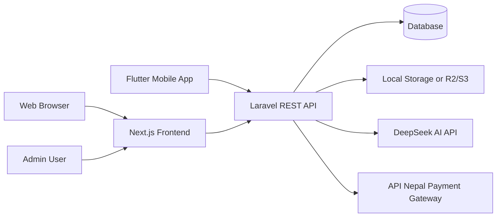

### 7.1 Architecture Explanation

- The Next.js frontend communicates with the Laravel backend using Axios.
- The Flutter app communicates with the same Laravel backend using HTTP requests.
- Laravel Sanctum issues API tokens after login and registration.
- Authenticated API routes require a Bearer token.
- User data, notes, files, payments, settings, and sharing records are stored in the database.
- Uploaded files are stored either locally or in an S3-compatible storage service such as Cloudflare R2.
- Payment subscriptions are initiated through API Nepal.
- AI summaries are generated through DeepSeek when an API key is configured.
- Admins use protected admin routes to manage the system.

---

## 8. User Roles

| Role | Description | Main Permissions |
| --- | --- | --- |
| Guest | Visitor without login | View landing page, register, login, use local mobile notes |
| User | Registered user | Manage own notes, files, friends, profile, shared notes |
| Premium User | User with active premium subscription | Increased storage and premium-enabled account status |
| Admin | Platform administrator | Manage users, notes, plans, payments, settings, and platform activity |

---

## 9. Main Features

### 9.1 Authentication

- Register using name, username, email, password, and password confirmation.
- Login using username or email.
- Logout by deleting the current Sanctum token.
- Fetch current user profile using `/me`.
- Update profile.
- Change password.
- Token storage on frontend and mobile.

### 9.2 Notes

- Create notes with title, content, plain text, and color.
- Edit and autosave notes on web.
- Pin and unpin notes.
- Archive and unarchive notes.
- Trash and restore notes.
- Permanently delete notes.
- View previous note versions.
- Generate and regenerate share codes.
- Redeem share codes.
- Generate AI summaries.

### 9.3 Collaboration

- Add friends by username.
- Accept or reject friend requests.
- Remove friends.
- Share notes only with accepted friends.
- Assign `view` or `edit` permission.
- Manage collaborators.
- View notes shared with the current user.

### 9.4 Files

- Upload files to account storage.
- Attach files to notes.
- Enforce storage limits.
- Download files through signed or generated URLs.
- Delete files.
- Preview PDFs in the web and mobile app.

### 9.5 Subscriptions

- View subscription plans.
- Initiate subscription payment.
- Handle payment IPN.
- Activate subscription after successful payment.
- Update premium status and storage limit.
- View payment history.

### 9.6 Admin Panel

- View platform dashboard statistics.
- Manage users.
- View and delete notes.
- View payments.
- Create, update, and delete subscription plans.
- Manage global settings.
- Test SMTP settings.
- View shared notes, friendships, and activity logs.

---

## 10. Backend Documentation

### 10.1 Backend Overview

The backend is a Laravel API application. It is responsible for:

- Authentication and user identity.
- Database operations.
- Permission checks.
- Note management.
- Sharing and collaboration rules.
- File upload/download.
- Subscription and payment processing.
- Admin operations.
- Integration with external services.

Backend root:

```text
backend/notexa/
```

### 10.2 Backend Dependencies

Important Composer dependencies:

| Package | Purpose |
| --- | --- |
| `laravel/framework` | Laravel application framework |
| `laravel/sanctum` | API token authentication |
| `league/flysystem-aws-s3-v3` | S3/R2-compatible file storage |
| `pusher/pusher-php-server` | Real-time/event support dependency |
| `guzzlehttp/guzzle` | HTTP client for integrations |
| `phpunit/phpunit` | Testing |

### 10.3 Backend Authentication

The backend uses Laravel Sanctum personal access tokens.

Authentication flow:

1. User registers or logs in.
2. Backend validates credentials.
3. Backend creates a Sanctum token.
4. Frontend/mobile stores the token.
5. Each protected request sends:

```text
Authorization: Bearer <token>
```

6. Laravel `auth:sanctum` middleware verifies the token.

### 10.4 Backend Middleware

Middleware configured in `bootstrap/app.php`:

| Middleware | Purpose |
| --- | --- |
| `HandleCors` | Allows API requests from frontend/mobile clients |
| `auth:sanctum` | Protects authenticated API routes |
| `is_admin` | Restricts admin routes to admin users |
| `is_premium` | Available for premium-only route protection |

### 10.5 CORS

The backend CORS configuration allows API access for:

- `api/*`
- `sanctum/csrf-cookie`

The current configuration allows all origins, methods, and headers, with credentials disabled. For production, this can be restricted to known frontend domains.

### 10.6 Backend Models

| Model | Purpose |
| --- | --- |
| `User` | Stores user profile, role, premium state, storage usage, and authentication data |
| `Note` | Stores note title, rich content, plain text, status flags, share code, and AI summary |
| `File` | Stores uploaded file metadata and storage path/key |
| `Friendship` | Stores friend request and accepted friend relationship status |
| `NoteShare` | Stores note sharing permission between users |
| `NoteVersion` | Stores note content history/version records |
| `SubscriptionPlan` | Stores available premium plans |
| `Subscription` | Stores active or expired user subscriptions |
| `Payment` | Stores payment records and gateway responses |
| `SiteSetting` | Stores configurable site, SMTP, payment, storage, and AI settings |
| `ActivityLog` | Stores admin/user activity records |

### 10.7 Database Entity Relationship Diagram

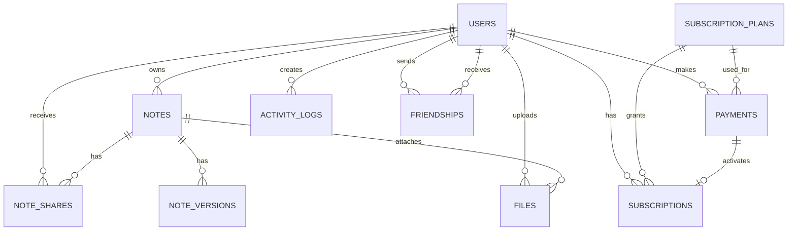

### 10.8 Database Tables

#### users

Stores account and authorization information.

| Column | Purpose |
| --- | --- |
| `id` | Primary key |
| `name` | Full name |
| `username` | Unique username used for login/friends |
| `email` | Unique email |
| `email_verified_at` | Email verification timestamp |
| `password` | Hashed password |
| `avatar` | Optional avatar |
| `role` | `user` or `admin` |
| `is_premium` | Premium account flag |
| `premium_expires_at` | Premium expiry timestamp |
| `storage_used` | Used storage in bytes |
| `storage_limit` | Allowed storage limit in bytes |
| `is_active` | Account active/suspended flag |
| `remember_token` | Laravel remember token |
| `created_at`, `updated_at` | Timestamps |

#### notes

Stores user notes and note status.

| Column | Purpose |
| --- | --- |
| `id` | Primary key |
| `user_id` | Owner user |
| `title` | Note title |
| `content` | Rich HTML content |
| `plain_text` | Searchable plain text |
| `color` | Note card color |
| `is_pinned` | Pin status |
| `is_archived` | Archive status |
| `is_trashed` | Trash status |
| `share_code` | Unique share code |
| `ai_summary` | Generated AI summary |
| `trashed_at` | Trash timestamp |
| `created_at`, `updated_at` | Timestamps |

#### friendships

Stores friend request and friendship status.

| Column | Purpose |
| --- | --- |
| `sender_id` | User who sent request |
| `receiver_id` | User who receives request |
| `status` | `pending`, `accepted`, `rejected`, or `blocked` |
| Unique pair | Prevents duplicate request pairs |

#### note_shares

Stores note collaboration permissions.

| Column | Purpose |
| --- | --- |
| `note_id` | Shared note |
| `shared_by` | Owner/sharer |
| `shared_with` | Receiver user |
| `permission` | `view` or `edit` |
| Unique pair | Prevents duplicate share for same user/note |

#### files

Stores uploaded file metadata.

| Column | Purpose |
| --- | --- |
| `user_id` | Uploading user |
| `note_id` | Optional attached note |
| `original_name` | Original uploaded filename |
| `stored_name` | Internal filename |
| `path` | Local path or local marker |
| `mime_type` | File MIME type |
| `size` | File size in bytes |
| `r2_key` | R2/S3 object key |
| `r2_url` | R2/S3 URL |

#### subscription_plans

Stores premium plans.

| Column | Purpose |
| --- | --- |
| `name` | Plan name |
| `description` | Plan description |
| `price` | Plan price |
| `currency` | Currency, default NPR |
| `duration_days` | Subscription duration |
| `storage_limit` | Storage granted by plan |
| `file_sharing_enabled` | Feature flag |
| `is_active` | Plan availability |

#### payments

Stores payment attempts and gateway responses.

| Column | Purpose |
| --- | --- |
| `user_id` | Paying user |
| `plan_id` | Selected plan |
| `identifier` | Unique payment identifier |
| `trx_number` | Gateway transaction number |
| `amount` | Amount |
| `currency` | Currency |
| `status` | `pending`, `success`, `failed`, or `cancelled` |
| `gateway_response` | JSON gateway response |
| `payment_method` | Payment method |

#### subscriptions

Stores activated premium subscriptions.

| Column | Purpose |
| --- | --- |
| `user_id` | Subscriber |
| `plan_id` | Plan |
| `payment_id` | Payment that activated subscription |
| `starts_at` | Subscription start date |
| `expires_at` | Subscription end date |
| `is_active` | Active flag |

#### site_settings

Stores dynamic application settings.

| Column | Purpose |
| --- | --- |
| `key` | Setting key |
| `value` | Setting value |
| `type` | Value type such as string, boolean, integer, or JSON |
| `group` | Setting group such as general, SMTP, payment, storage, or AI |

#### note_versions

Stores note history.

| Column | Purpose |
| --- | --- |
| `note_id` | Note |
| `user_id` | User who made version |
| `content` | Version content |
| `version_number` | Sequential version number |

#### activity_logs

Stores activity records.

| Column | Purpose |
| --- | --- |
| `user_id` | Actor |
| `action` | Action name |
| `subject_type` | Related model type |
| `subject_id` | Related model ID |
| `metadata` | Extra JSON data |

### 10.9 API Routes

Base API path:

```text
/api
```

#### Public Routes

| Method | Endpoint | Purpose |
| --- | --- | --- |
| `POST` | `/register` | Register a new user |
| `POST` | `/login` | Login using username/email and password |
| `POST` | `/subscription/ipn` | Receive payment gateway IPN |
| `GET` | `/settings/public` | Fetch public settings |
| `GET` | `/files/{file}/content` | Serve signed file content |

#### Auth Routes

| Method | Endpoint | Purpose |
| --- | --- | --- |
| `POST` | `/logout` | Logout current token |
| `GET` | `/me` | Get current user and stats |
| `PUT` | `/profile` | Update profile |
| `PUT` | `/change-password` | Change account password |

#### Notes Routes

| Method | Endpoint | Purpose |
| --- | --- | --- |
| `GET` | `/notes` | List own notes with filters/search |
| `POST` | `/notes` | Create note |
| `GET` | `/notes/archived` | List archived notes |
| `GET` | `/notes/trashed` | List trashed notes |
| `GET` | `/notes/{note}` | Show note if user can view |
| `PUT` | `/notes/{note}` | Update note if user can edit |
| `DELETE` | `/notes/{note}` | Move note to trash |
| `POST` | `/notes/{note}/restore` | Restore trashed note |
| `DELETE` | `/notes/{note}/permanent` | Permanently delete note |
| `PATCH` | `/notes/{note}/pin` | Toggle pin state |
| `PATCH` | `/notes/{note}/archive` | Toggle archive state |
| `GET` | `/notes/{note}/versions` | View note versions |
| `GET` | `/notes/{note}/share-code` | Get note share code |
| `POST` | `/notes/{note}/regenerate-code` | Create a new share code |
| `POST` | `/notes/redeem-code` | Redeem a note share code |
| `POST` | `/notes/{note}/ai-summary` | Generate AI summary |

#### Sharing Routes

| Method | Endpoint | Purpose |
| --- | --- | --- |
| `GET` | `/shared-with-me` | List notes shared with current user |
| `POST` | `/notes/{note}/share` | Share note with a friend |
| `PUT` | `/notes/{note}/share/{userId}` | Update collaborator permission |
| `DELETE` | `/notes/{note}/share/{userId}` | Remove collaborator |
| `GET` | `/notes/{note}/collaborators` | List note collaborators |

#### Friends Routes

| Method | Endpoint | Purpose |
| --- | --- | --- |
| `GET` | `/friends` | List accepted friends |
| `GET` | `/friends/requests` | List sent and received friend requests |
| `POST` | `/friends/request` | Send friend request by username |
| `PUT` | `/friends/accept/{friendship}` | Accept request |
| `PUT` | `/friends/reject/{friendship}` | Reject request |
| `DELETE` | `/friends/{userId}` | Remove friend |
| `GET` | `/friends/search` | Search users |

#### File Routes

| Method | Endpoint | Purpose |
| --- | --- | --- |
| `GET` | `/files` | List uploaded files |
| `POST` | `/files/upload` | Upload file, optionally attached to a note |
| `GET` | `/files/{file}/download` | Get download URL |
| `DELETE` | `/files/{file}` | Delete uploaded file |

#### Subscription Routes

| Method | Endpoint | Purpose |
| --- | --- | --- |
| `GET` | `/subscription/plans` | List active plans |
| `GET` | `/subscription/my` | Get current subscription |
| `POST` | `/subscription/subscribe` | Start subscription payment |
| `GET` | `/subscription/payment-history` | Get user payment history |

#### Admin Routes

Admin routes require both `auth:sanctum` and `is_admin`.

| Method | Endpoint | Purpose |
| --- | --- | --- |
| `GET` | `/admin/dashboard` | Dashboard statistics |
| `GET` | `/admin/users` | List users |
| `GET` | `/admin/users/{user}` | User detail |
| `PUT` | `/admin/users/{user}` | Update user |
| `DELETE` | `/admin/users/{user}` | Delete user |
| `GET` | `/admin/notes` | List notes |
| `DELETE` | `/admin/notes/{note}` | Delete note |
| `GET` | `/admin/payments` | List payments |
| `GET` | `/admin/plans` | List plans |
| `POST` | `/admin/plans` | Create plan |
| `PUT` | `/admin/plans/{plan}` | Update plan |
| `DELETE` | `/admin/plans/{plan}` | Delete plan |
| `GET` | `/admin/settings` | Get settings |
| `PUT` | `/admin/settings` | Update settings |
| `POST` | `/admin/settings/smtp/test` | Test SMTP |
| `GET` | `/admin/shared-notes` | View shared notes |
| `GET` | `/admin/friendships` | View friendships |
| `GET` | `/admin/activity-logs` | View activity logs |

### 10.10 Controllers

| Controller | Responsibility |
| --- | --- |
| `AuthController` | Register, login, logout, current user, profile update, password change |
| `NoteController` | Notes CRUD, archive, trash, restore, versions, share code, AI summary |
| `NoteShareController` | Shared notes, collaborator management, permission updates |
| `FriendController` | Friend list, requests, accept/reject, remove, search |
| `FileController` | File upload, listing, download, signed serving, delete |
| `SubscriptionController` | Plans, subscribe, IPN handling, payment history |
| `AdminController` | Dashboard, users, notes, payments, plans, settings, logs |

### 10.11 Important Backend Business Rules

- A user can view a note if they own it or it is shared with them.
- A user can edit a note if they own it or have `edit` permission.
- Only note owners can manage share codes and collaborators.
- Notes shared with friends require an accepted friendship.
- File upload checks storage quota before saving.
- File download is allowed for file owners or users who can view the attached note.
- Subscription activation updates `is_premium`, `premium_expires_at`, and `storage_limit`.
- Admin users cannot accidentally remove all administration capability because admin deletion is protected in controller logic.

### 10.12 Backend Services

#### R2StorageService

Handles file upload, URL generation, temporary download URLs, signed local file routes, and file deletion.

Storage behavior:

- If R2/S3 settings are configured, files are stored remotely.
- If remote storage is not configured, files fall back to local public storage.
- Local files are marked using a `local:` style path.

#### DeepSeekService

Generates short AI note summaries.

Behavior:

- Reads API key from site settings.
- Sends note content to DeepSeek chat completions.
- Returns a concise summary.
- Returns `null` if the service is not configured or if the request fails.

#### ApiNepalPaymentService

Handles payment gateway interaction.

Behavior:

- Reads API Nepal settings from site settings/config.
- Initiates payment requests.
- Generates success/cancel frontend URLs.
- Validates IPN using HMAC.
- Supports checking payment status.

### 10.13 Backend Seeder Data

The database seeder creates:

- A development admin user.
- Premium Monthly plan.
- Premium Yearly plan.
- Site settings for general app configuration, email, SMTP, legal, payment, storage, and AI.

Production note: seeded development credentials must be changed immediately before deployment.

---

## 11. Frontend Documentation

### 11.1 Frontend Overview

The frontend is a Next.js 16 application using React 19. It provides:

- Public landing/about pages.
- Authentication pages.
- User dashboard.
- Rich note editor.
- Friends, sharing, files, subscriptions, and settings pages.
- Admin dashboard.

Frontend root:

```text
frontend/
```

### 11.2 Frontend Dependencies

Important npm dependencies:

| Package | Purpose |
| --- | --- |
| `next` | Next.js framework |
| `react`, `react-dom` | React UI |
| `axios` | API communication |
| `zustand` | Auth state store |
| `@tiptap/*` | Rich note editor |
| `lucide-react` | Icons |
| `react-hot-toast` | Toast notifications |
| `tailwindcss` | Styling |
| `@tailwindcss/postcss` | Tailwind 4 PostCSS integration |

### 11.3 Frontend API Configuration

API client file:

```text
frontend/src/services/api.ts
```

Current default API URL:

```text
https://app.notexa.cloud/api
```

The API service normalizes the base URL so the application consistently targets `/api`.

Environment variable:

```text
NEXT_PUBLIC_API_URL=https://app.notexa.cloud/api
```

### 11.4 Axios Client Behavior

The Axios client:

- Uses JSON headers.
- Uses a 30-second timeout.
- Reads token from localStorage key `notexa_token`.
- Adds `Authorization: Bearer <token>` automatically.
- Redirects to login on `401 Unauthorized`, except for login/register requests.

### 11.5 Frontend Authentication State

Auth store file:

```text
frontend/src/contexts/authStore.ts
```

Stored values:

- `user`
- `stats`
- `token`
- `isLoading`
- `isAuthenticated`

LocalStorage keys:

- `notexa_token`
- `notexa_user`

Important auth functions:

- `setAuth`
- `setUser`
- `fetchMe`
- `logout`
- `initialize`

### 11.6 Frontend Styling

Global CSS file:

```text
frontend/src/app/globals.css
```

Tailwind CSS 4 is loaded using:

```css
@import "tailwindcss";
@config "../../tailwind.config.js";
```

The project uses `@tailwindcss/postcss` for PostCSS compatibility with Tailwind CSS 4.

The same file also includes custom editor styles for TipTap content, placeholders, task lists, code blocks, links, and rich text formatting.

### 11.7 Frontend Pages and Routes

#### Public Pages

| Route | Purpose |
| --- | --- |
| `/` | Landing page |
| `/about` | About/project information |

#### Authentication Pages

| Route | Purpose |
| --- | --- |
| `/auth/login` | Login page |
| `/auth/register` | Register page |

#### User Dashboard Pages

| Route | Purpose |
| --- | --- |
| `/dashboard` | My notes |
| `/dashboard/notes/[id]` | Note editor/detail |
| `/dashboard/shared` | Shared with me |
| `/dashboard/friends` | Friends and friend requests |
| `/dashboard/files` | File manager |
| `/dashboard/subscription` | Plans and payment history |
| `/dashboard/settings` | Profile and password settings |

#### Admin Pages

| Route | Purpose |
| --- | --- |
| `/admin` | Admin dashboard |
| `/admin/users` | User management |
| `/admin/notes` | Note management |
| `/admin/payments` | Payment monitoring |
| `/admin/settings` | Platform settings |

### 11.8 Dashboard Layout

The dashboard layout protects authenticated pages. If the user is not logged in, it redirects to `/auth/login`.

Dashboard navigation includes:

- My Notes
- Shared with Me
- Friends
- My Files
- Subscription
- Settings
- Admin link for admin users
- Redeem share code modal
- Logout

### 11.9 Admin Layout

The admin layout protects admin-only pages. It requires:

- Authenticated user.
- User role equal to `admin`.

Admin navigation includes:

- Dashboard
- Users
- Notes
- Payments
- Settings
- Back to app

### 11.10 Rich Note Editor

Editor component:

```text
frontend/src/components/NoteEditor.tsx
```

The web editor uses TipTap with:

- StarterKit
- Placeholder
- Highlight
- TaskList
- TaskItem
- Image
- Link
- Underline
- TextAlign

Toolbar features:

- Bold
- Italic
- Underline
- Strike
- Highlight
- Headings
- Bullet list
- Ordered list
- Task list
- Quote
- Inline code
- Code block
- Horizontal rule
- Text alignment
- Image insertion
- Link insertion
- Undo/redo

### 11.11 Web User Workflows

#### Login/Register

- User submits form.
- Frontend calls `authApi.login` or `authApi.register`.
- Backend returns token and user.
- Frontend stores token/user in Zustand and localStorage.
- User is redirected to dashboard.

#### Notes

- Dashboard fetches notes using search/filter.
- User creates note from modal.
- Note detail page loads selected note.
- Editor autosaves after content changes.
- Save failure stores local draft backup in browser storage.
- User can pin, archive, trash, restore, and permanently delete notes.

#### Sharing

- Owner opens share panel.
- Owner can view/copy share code.
- Owner can regenerate share code.
- Owner can share note with accepted friends.
- Owner can set permission to `view` or `edit`.
- Collaborators can be removed.

#### Files

- User uploads files.
- Files can be attached to notes.
- Files can be downloaded.
- PDFs can be previewed.
- Storage usage progress is displayed.

#### Subscription

- User views current subscription and storage.
- User selects active plan.
- Frontend redirects user to payment gateway when backend returns payment URL.
- Payment history is displayed.

#### Settings

- User updates name and username.
- User changes password.
- Frontend displays validation and network errors.

### 11.12 Admin Workflows

#### Dashboard

Displays platform statistics and charts.

#### Users

Admin can:

- Search users.
- View details.
- Toggle active state.
- Toggle premium state.
- Delete non-admin users.

#### Notes

Admin can:

- Search notes.
- View note metadata.
- Delete notes.

#### Payments

Admin can:

- View payment records.
- Filter by payment status.

#### Settings

Admin can configure:

- General app settings.
- SMTP settings.
- Email settings.
- Legal content.
- Payment gateway settings.
- R2/S3 storage settings.
- DeepSeek AI settings.
- SMTP test email.

---

## 12. Flutter Mobile App Documentation

### 12.1 Flutter Overview

The Flutter app provides mobile access to Notexa. It supports both:

- Local/offline note usage without login.
- Authenticated cloud sync and collaboration.

Flutter root:

```text
notexa_app/
```

### 12.2 Flutter Dependencies

Important Flutter packages:

| Package | Purpose |
| --- | --- |
| `http` | API requests |
| `shared_preferences` | Token and local note storage |
| `provider` | State management |
| `file_picker` | Select files/PDFs |
| `url_launcher` | Open download links |
| `intl` | Date/format utilities |
| `google_fonts` | Font styling |
| `path_provider` | Local file paths |
| `connectivity_plus` | Connectivity support |
| `syncfusion_flutter_pdfviewer` | PDF viewing |

### 12.3 Flutter App Entry Point

Main file:

```text
notexa_app/lib/main.dart
```

The app:

- Uses `runZonedGuarded` for global error handling.
- Installs `AppErrorHandler`.
- Uses Provider for `AuthService`.
- Uses `MaterialApp`.
- Uses Outfit font styling.
- Starts from `DashboardScreen`.

### 12.4 Flutter API Service

API service file:

```text
notexa_app/lib/services/api_service.dart
```

Current development base URL:

```text
http://127.0.0.1:8000/api
```

Important production note:

- For a real Android/iOS build, this URL must be changed to the live backend, for example:

```text
https://app.notexa.cloud/api
```

Recommended improvement:

- Replace the hardcoded URL with a build-time value using `--dart-define`.

Example:

```dart
static const String baseUrl = String.fromEnvironment(
  'API_URL',
  defaultValue: 'https://app.notexa.cloud/api',
);
```

Then build with:

```bash
flutter build apk --dart-define=API_URL=https://app.notexa.cloud/api
```

### 12.5 Flutter Auth Service

Auth service file:

```text
notexa_app/lib/services/auth_service.dart
```

Responsibilities:

- Store token and user in SharedPreferences.
- Restore login state at app startup.
- Login and register.
- Logout.
- Fetch current user.
- Update profile.
- Expose `isAuthenticated`, `isAdmin`, and `isPremium`.

### 12.6 Flutter Local Note Storage

Local note storage file:

```text
notexa_app/lib/services/local_note_storage.dart
```

Responsibilities:

- Store offline notes in SharedPreferences.
- Use local negative IDs for unsynced notes.
- Create local drafts.
- Save local changes.
- Delete local notes.
- Replace local note ID after cloud sync.
- Sync dirty notes to backend.
- Sync cloud notes into local storage.
- Convert text to plain text and basic HTML.

This makes the mobile app usable without login or internet.

### 12.7 Flutter Error Handler

Error handler file:

```text
notexa_app/lib/services/error_handler.dart
```

Responsibilities:

- Capture global Flutter errors.
- Convert API, timeout, network, platform, and format errors into user-friendly messages.
- Show snackbars or dialogs.
- Avoid app crashes from common request failures.

### 12.8 Flutter Screens

| Screen | Purpose |
| --- | --- |
| `DashboardScreen` | Bottom navigation shell |
| `LoginScreen` | User login |
| `RegisterScreen` | User registration |
| `NotesListScreen` | Notes list, local/cloud mode, search, create notes, redeem code |
| `NoteEditorScreen` | Edit note, local save, cloud save, attach files, AI summary, sharing |
| `SharedScreen` | Notes shared with current user |
| `FriendsScreen` | Friends, requests, add friend |
| `FilesScreen` | Upload, list, download, and delete files |
| `PdfViewerScreen` | Local/remote PDF viewing |
| `SettingsScreen` | Local mode info, login/register prompt, profile update, password change, logout |

### 12.9 Flutter Navigation

Authenticated user navigation:

- Notes
- Shared
- Friends
- Files
- Settings

Guest/local user navigation:

- Notes
- Cloud

This allows unauthenticated users to create local notes first and later sign in for cloud features.

### 12.10 Flutter Mobile Workflows

#### Local Notes

1. Guest opens app.
2. User creates a note locally.
3. Note is stored in SharedPreferences.
4. User can attach local PDFs.
5. User can sign in later for cloud sync.

#### Cloud Sync

1. Authenticated user opens notes list.
2. App syncs dirty local notes.
3. Local notes are created/updated on backend.
4. Cloud note IDs replace local negative IDs.
5. Cloud notes are synced back to local storage.

#### Mobile Sharing

1. User opens note editor.
2. User can fetch or regenerate share code.
3. User can share with friends.
4. User can assign `view` or `edit` permission.
5. Collaborators can be removed or updated.

#### Mobile Files

1. User selects a file using file picker.
2. App uploads file through multipart request.
3. File appears in the files list.
4. Download URL can be opened through `url_launcher`.
5. PDFs can be opened in `PdfViewerScreen`.

---

## 13. End-to-End Workflows

### 13.1 User Registration

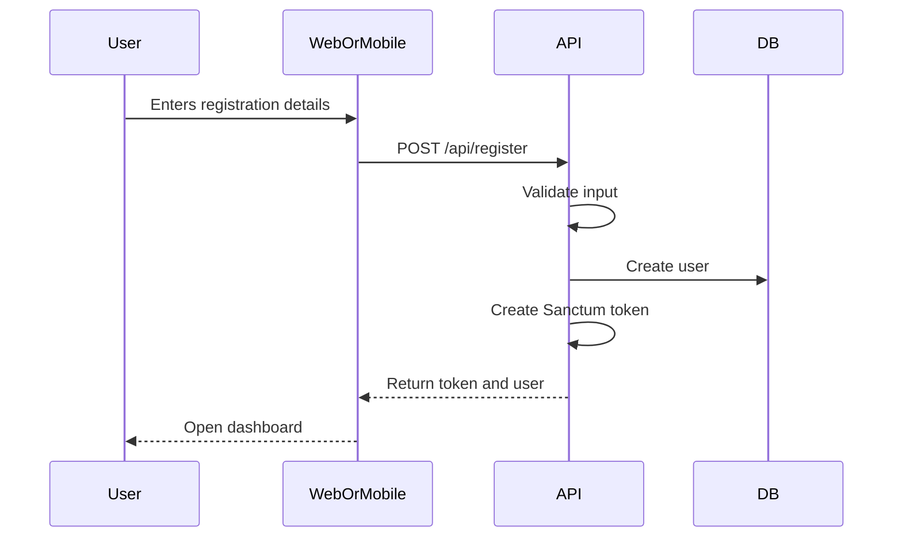

### 13.2 Create and Edit Note

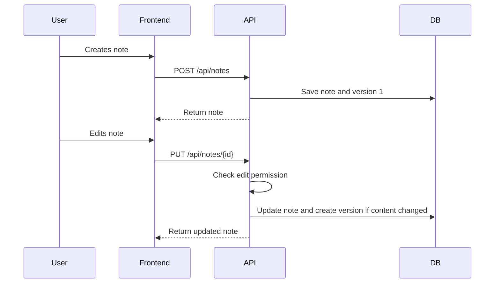

### 13.3 Share Note With Friend

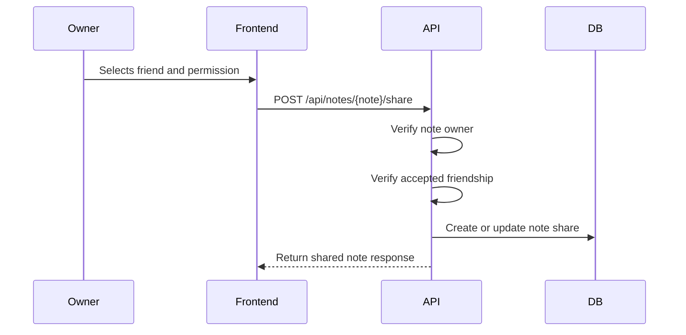

### 13.4 Redeem Share Code

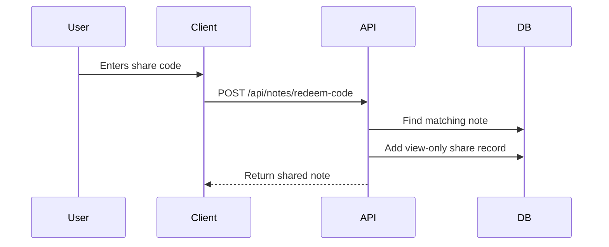

### 13.5 File Upload

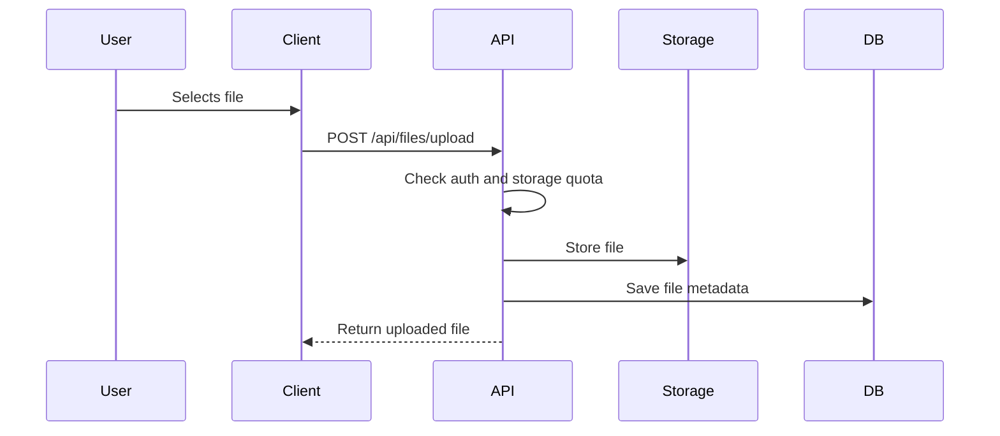

### 13.6 Subscription Payment

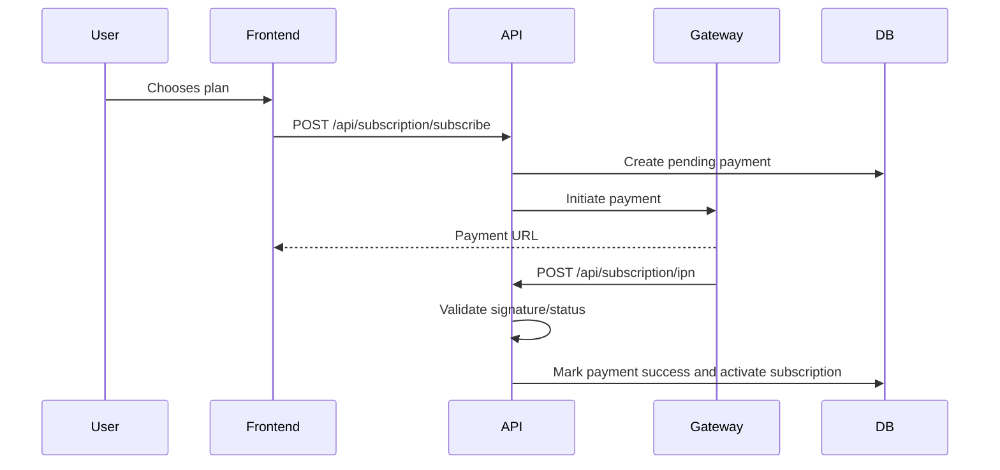

---

## 14. Security and Validation

### 14.1 Authentication Security

- Passwords are hashed by Laravel.
- Sanctum tokens are used for API authentication.
- Protected routes require `auth:sanctum`.
- Admin routes require `is_admin`.
- Login supports username or email.
- Inactive users are blocked from login.

### 14.2 Authorization Security

- Note view/edit actions use model permission methods.
- Only owners can share notes with friends.
- Only owners can regenerate share codes.
- File access checks owner or note view permission.
- Admin-only operations are separated under `/admin`.

### 14.3 Input Validation

Backend validates:

- Registration fields.
- Login credentials.
- Profile update fields.
- Password change fields.
- Note creation/update fields.
- File uploads and size limits.
- Subscription plan input.
- Admin settings and plan data.

### 14.4 File Security

- File uploads are limited to 50 MB.
- Storage quota is checked before upload.
- Download URLs are generated by backend.
- Local file serving uses signed routes where applicable.
- File deletion updates user storage usage.

### 14.5 Production Security Recommendations

- Restrict CORS to actual frontend/mobile domains.
- Change seeded development admin credentials.
- Store secrets only in `.env` or admin settings, not in source code.
- Use HTTPS for frontend and backend.
- Enable database backups.
- Configure queue/log monitoring.
- Validate payment IPN signatures in production mode.
- Avoid exposing debug errors on production.

---

## 15. Deployment Documentation

### 15.1 Backend Requirements

Required:

- PHP 8.3 or newer.
- Composer.
- MySQL/MariaDB or another Laravel-supported database.
- Web server such as Nginx or Apache.
- Writable `storage/` and `bootstrap/cache/`.
- HTTPS domain for production.

### 15.2 Backend Environment Variables

Example backend environment keys:

```env
APP_NAME=Notexa
APP_ENV=production
APP_KEY=base64:generated_key
APP_DEBUG=false
APP_URL=https://app.notexa.cloud

DB_CONNECTION=mysql
DB_HOST=127.0.0.1
DB_PORT=3306
DB_DATABASE=notexa
DB_USERNAME=notexa_user
DB_PASSWORD=change_me

FRONTEND_URL=https://notexa.cloud
SANCTUM_STATEFUL_DOMAINS=notexa.cloud,app.notexa.cloud

FILESYSTEM_DISK=public
```

Do not commit real passwords, API keys, SMTP passwords, R2 keys, or payment secrets.

### 15.3 Backend Installation Commands

From:

```text
backend/notexa/
```

Run:

```bash
composer install --no-dev --optimize-autoloader
cp .env.example .env
php artisan key:generate
php artisan migrate --seed
php artisan storage:link
php artisan config:cache
php artisan route:cache
php artisan view:cache
```

For development:

```bash
composer install
php artisan migrate --seed
php artisan serve
```

### 15.4 Backend Web Server

The server document root must point to:

```text
backend/notexa/public
```

Never expose the Laravel project root directly as the public web root.

### 15.5 Frontend Requirements

Required:

- Node.js 24.15+.
- npm 11+.

The server log in the project indicates Node 24.16.0 is suitable.

### 15.6 Frontend Environment

Create/update:

```text
frontend/.env.local
```

With:

```env
NEXT_PUBLIC_API_URL=https://app.notexa.cloud/api
```

### 15.7 Frontend Installation and Build

From:

```text
frontend/
```

Run:

```bash
npm install
npm run build
npm start
```

For development:

```bash
npm run dev
```

### 15.8 Tailwind CSS 4 Build Requirement

This project uses Tailwind CSS 4. The PostCSS plugin must be:

```text
@tailwindcss/postcss
```

The global CSS entry must use:

```css
@import "tailwindcss";
@config "../../tailwind.config.js";
```

This prevents the production build error caused by using `tailwindcss` directly as a PostCSS plugin.

### 15.9 Flutter Requirements

Required:

- Flutter SDK compatible with Dart SDK `>=3.2.0 <4.0.0`.
- Android Studio or Xcode for platform builds.
- Android/iOS device or emulator.

### 15.10 Flutter Setup

From:

```text
notexa_app/
```

Run:

```bash
flutter pub get
flutter run
```

For Android APK:

```bash
flutter build apk --release
```

Before production build, update the API URL in `ApiService` or use `--dart-define` as described in section 12.4.

---

## 16. Testing Documentation

### 16.1 Backend Testing

Recommended tests:

- Registration validation.
- Login using username and email.
- Authenticated `/me` endpoint.
- Note CRUD.
- Note permission checks.
- Share code redemption.
- Friend request lifecycle.
- File upload quota checks.
- Subscription IPN success/failure.
- Admin route authorization.

Command:

```bash
php artisan test
```

### 16.2 Frontend Testing

Recommended manual checks:

- Landing page loads.
- Register and login forms work.
- Token persists after refresh.
- Dashboard redirects unauthenticated users.
- Notes list loads.
- Rich editor saves content.
- Sharing modal works.
- Files upload/download.
- Admin routes block non-admin users.
- Tailwind styles load after production build.

Command:

```bash
npm run build
```

### 16.3 Flutter Testing

Recommended checks:

- App starts without authentication.
- Local note can be created offline.
- Local note persists after app restart.
- Login works.
- Cloud sync uploads dirty local notes.
- Shared notes load.
- Friends screen loads and can send request.
- Files screen uploads/downloads.
- PDF viewer opens local and remote PDFs.

Commands:

```bash
flutter analyze
flutter test
```

### 16.4 Manual Test Case Table

| Test Case | Steps | Expected Result |
| --- | --- | --- |
| Register user | Submit valid registration form | User account created and dashboard opens |
| Login user | Submit username/email and password | Token saved and dashboard opens |
| Create note | Click new note and save title/content | Note appears in notes list |
| Edit note | Open note, edit content, wait for autosave | Updated content persists |
| Trash note | Delete note | Note moves to trash |
| Restore note | Restore from trash | Note returns to notes list |
| Share by friend | Share note with accepted friend | Friend sees note in shared page |
| Share by code | Redeem valid share code | Note appears as shared note |
| Upload file | Select file and upload | File appears in file list |
| Download file | Click download | Download URL opens |
| Subscribe | Select plan and continue payment | Gateway redirect URL opens |
| Admin users | Admin opens users page | User list and management actions appear |
| Mobile local note | Create note without login | Note persists locally |
| Mobile sync | Login after local note | Local note syncs to cloud |

---

## 17. API Response Pattern

Most API responses follow a JSON structure similar to:

```json
{
  "message": "Operation completed",
  "data": {}
}
```

Validation errors are returned with Laravel validation error structure and HTTP status `422`.

Unauthorized requests return HTTP status `401`.

Forbidden actions return HTTP status `403`.

Missing records return HTTP status `404`.

---

## 18. Error Handling

### 18.1 Backend

Laravel handles:

- Validation exceptions.
- Authentication exceptions.
- Authorization failures.
- Model not found exceptions.
- Service failure responses.

### 18.2 Frontend

The Axios API client:

- Handles token injection.
- Redirects on unauthorized responses.
- Surfaces validation/network errors to UI components.
- Uses toast notifications for user feedback.

### 18.3 Flutter

The Flutter error handler:

- Converts common API and network errors into readable messages.
- Shows snackbars and dialogs.
- Captures global Flutter errors.
- Prevents app crashes from unhandled UI errors where possible.

---

## 19. Configuration and Settings

Notexa stores many settings in the `site_settings` table so admins can update them without editing code.

Settings groups include:

| Group | Examples |
| --- | --- |
| General | Site name, public configuration |
| Email | Email verification and templates |
| SMTP | Host, port, username, password, encryption |
| Legal | Terms, privacy, support information |
| Payment | API Nepal keys, mode, payment settings |
| Storage | R2/S3 configuration |
| AI | DeepSeek API key and AI settings |

Admin settings page provides UI for editing these values.

---

## 20. Important Code Paths

### Backend

```text
backend/notexa/routes/api.php
backend/notexa/app/Http/Controllers/AuthController.php
backend/notexa/app/Http/Controllers/NoteController.php
backend/notexa/app/Http/Controllers/NoteShareController.php
backend/notexa/app/Http/Controllers/FriendController.php
backend/notexa/app/Http/Controllers/FileController.php
backend/notexa/app/Http/Controllers/SubscriptionController.php
backend/notexa/app/Http/Controllers/AdminController.php
backend/notexa/app/Models/User.php
backend/notexa/app/Models/Note.php
backend/notexa/app/Services/R2StorageService.php
backend/notexa/app/Services/DeepSeekService.php
backend/notexa/app/Services/ApiNepalPaymentService.php
backend/notexa/database/migrations/
```

### Frontend

```text
frontend/src/services/api.ts
frontend/src/contexts/authStore.ts
frontend/src/components/NoteEditor.tsx
frontend/src/app/layout.tsx
frontend/src/app/auth/login/page.tsx
frontend/src/app/auth/register/page.tsx
frontend/src/app/dashboard/
frontend/src/app/admin/
frontend/src/app/globals.css
frontend/next.config.js
frontend/postcss.config.mjs
```

### Flutter

```text
notexa_app/lib/main.dart
notexa_app/lib/services/api_service.dart
notexa_app/lib/services/auth_service.dart
notexa_app/lib/services/local_note_storage.dart
notexa_app/lib/services/error_handler.dart
notexa_app/lib/screens/dashboard/dashboard_screen.dart
notexa_app/lib/screens/notes/notes_list_screen.dart
notexa_app/lib/screens/notes/note_editor_screen.dart
notexa_app/lib/screens/friends/friends_screen.dart
notexa_app/lib/screens/files/files_screen.dart
notexa_app/lib/screens/files/pdf_viewer_screen.dart
notexa_app/lib/screens/shared/shared_screen.dart
notexa_app/lib/screens/settings/settings_screen.dart
```

---

## 21. Known Deployment Notes From Current Code

### 21.1 Web Frontend API URL

The web frontend is configured to use:

```text
https://app.notexa.cloud/api
```

This is correct when the Laravel backend is deployed at `app.notexa.cloud`.

### 21.2 Flutter API URL

The Flutter app currently uses:

```text
http://127.0.0.1:8000/api
```

This is suitable only for local development on some environments. For production Android/iOS builds, use the live backend URL.

### 21.3 Frontend CSS

The frontend uses Tailwind CSS 4. CSS will fail in production if PostCSS is configured with the old `tailwindcss` plugin directly. Use `@tailwindcss/postcss`.

### 21.4 Zip Packaging

Do not include running log files such as:

```text
frontend/dev-server.log
frontend/dev-server.err.log
```

These files are unnecessary and may be locked by a running dev server on Windows.

---

## 22. Future Enhancements

Recommended future improvements:

- Add real-time collaborative editing using WebSockets.
- Add push notifications for shares and friend requests.
- Add email verification flow in the frontend/mobile app.
- Add password reset UI.
- Add richer mobile editor support.
- Add mobile subscription screen if required.
- Add automated CI/CD deployment.
- Add complete PHPUnit feature tests.
- Add frontend component tests.
- Add Flutter widget/integration tests.
- Add admin export reports for users, payments, and activity logs.
- Add audit history for admin setting changes.
- Add storage cleanup job for orphan files.
- Add scheduled job to expire premium subscriptions.
- Add stricter production CORS rules.
- Add `--dart-define` API URL configuration for Flutter.

---

## 23. Minor Project Report Addendum

This section adds the formal analysis content commonly required in a college minor-project report.

### 23.1 Proposed System

The proposed system is a web and mobile based collaborative note-taking platform. Instead of keeping notes, files, user sharing, and subscription management in separate tools, Notexa combines them into one application. The backend exposes secure APIs, the frontend provides a rich browser experience, and the Flutter app provides mobile access with offline local notes.

### 23.2 Existing System and Limitations

In a typical existing workflow, students or users may depend on basic notes apps, cloud drives, messaging apps, and manual sharing links. Such a workflow has several limitations:

- Notes and files are not stored together.
- Sharing permissions are difficult to manage.
- Offline and online versions can become inconsistent.
- Admin monitoring is not available.
- Subscription or storage limits are not integrated.
- AI-based summarization is not available inside the note workflow.

### 23.3 Advantages of Proposed System

- Centralized notes, files, sharing, friends, subscriptions, and admin control.
- Secure API authentication with Laravel Sanctum.
- Rich web editor for better note formatting.
- Mobile local/offline notes with cloud sync.
- Friend-based collaboration with clear permissions.
- Share-code based quick note access.
- Configurable storage, payment, SMTP, and AI settings.
- Admin dashboard for project demonstration and real-world management.

### 23.4 Functional Requirements

| ID | Requirement | Description |
| --- | --- | --- |
| FR-01 | User registration | Users must be able to create an account |
| FR-02 | User login | Users must be able to login with username/email and password |
| FR-03 | Profile management | Users must be able to update profile and password |
| FR-04 | Note creation | Users must be able to create notes |
| FR-05 | Note editing | Users and permitted collaborators must be able to edit notes |
| FR-06 | Note organization | Users must be able to pin, archive, trash, restore, and permanently delete notes |
| FR-07 | Note versions | System must store note content versions |
| FR-08 | Share code | Users must be able to share notes by code |
| FR-09 | Friend system | Users must be able to send, accept, reject, and remove friend requests |
| FR-10 | Note collaboration | Users must be able to share notes with friends using view/edit permission |
| FR-11 | File upload | Users must be able to upload and manage files |
| FR-12 | File attachment | Users must be able to attach files to notes |
| FR-13 | Storage limit | System must enforce account storage limits |
| FR-14 | Subscription | Users must be able to subscribe to premium plans |
| FR-15 | Payment IPN | System must process payment gateway notifications |
| FR-16 | AI summary | Users must be able to generate AI summaries when configured |
| FR-17 | Admin dashboard | Admin must be able to view platform statistics |
| FR-18 | Admin user management | Admin must be able to manage users |
| FR-19 | Admin plan management | Admin must be able to manage subscription plans |
| FR-20 | Admin settings | Admin must be able to configure SMTP, payment, storage, and AI settings |
| FR-21 | Mobile local mode | Mobile users must be able to create local notes without login |
| FR-22 | Mobile sync | Mobile users must be able to sync local notes after login |

### 23.5 Non-Functional Requirements

| Requirement | Description |
| --- | --- |
| Security | API routes must be protected using token authentication and role checks |
| Usability | UI should be simple enough for students and general users |
| Maintainability | Code is separated into backend, frontend, and mobile modules |
| Scalability | Storage can use local disk or R2/S3-compatible object storage |
| Availability | Production deployment should use HTTPS and reliable hosting |
| Performance | API responses should be paginated where lists can grow |
| Portability | Flutter app can run on Android/iOS with API URL adjustment |
| Reliability | Mobile app stores local notes to reduce data loss risk |
| Configurability | Admin settings allow changing SMTP, storage, payment, and AI details |

### 23.6 Hardware Requirements

#### Development Machine

| Component | Recommended |
| --- | --- |
| Processor | Intel i5/Ryzen 5 or better |
| RAM | 8 GB minimum, 16 GB recommended |
| Storage | 10 GB free space |
| Network | Internet connection for packages and external APIs |

#### Deployment Server

| Component | Recommended |
| --- | --- |
| Processor | 2 vCPU or better |
| RAM | 2 GB minimum, 4 GB recommended |
| Storage | Depends on uploaded files; object storage recommended |
| OS | Ubuntu/Linux hosting environment |
| Web Server | Nginx or Apache |

### 23.7 Software Requirements

| Software | Version/Use |
| --- | --- |
| PHP | 8.3 or newer |
| Composer | Laravel dependency management |
| Node.js | 24.15 or newer |
| npm | 11 or newer |
| Flutter SDK | Compatible with Dart `>=3.2.0 <4.0.0` |
| Database | MySQL/MariaDB or SQLite for development |
| Git | Source control |
| Browser | Chrome/Edge/Firefox |
| Postman | Optional API testing |

### 23.8 Feasibility Study

#### Technical Feasibility

The project is technically feasible because it uses mature frameworks: Laravel for the API, Next.js for the web application, and Flutter for mobile. Each stack has strong documentation, package support, and deployment options.

#### Operational Feasibility

The system is operationally feasible because users already understand the basic concept of note-taking, file uploads, sharing, and subscriptions. The admin panel also makes operation easier for administrators.

#### Economic Feasibility

The project can be developed and demonstrated with free or low-cost tools. Local development uses free open-source frameworks. Paid services such as cloud storage, payment gateway, and AI API are optional/configurable for production.

#### Schedule Feasibility

The project is suitable as a minor project because core modules can be implemented and demonstrated independently: authentication, notes, sharing, files, subscriptions, admin, and mobile sync.

### 23.9 Use Case Diagram

```mermaid
flowchart TB
    Guest["Guest User"]
    User["Registered User"]
    Premium["Premium User"]
    Admin["Admin"]
    System["Notexa System"]

    Guest --> UC1["Register"]
    Guest --> UC2["Login"]
    Guest --> UC3["Create local mobile notes"]

    User --> UC4["Manage notes"]
    User --> UC5["Upload files"]
    User --> UC6["Manage friends"]
    User --> UC7["Share notes"]
    User --> UC8["Redeem share code"]
    User --> UC9["Update profile"]
    User --> UC10["Subscribe to plan"]
    User --> UC11["Generate AI summary"]

    Premium --> UC12["Use increased storage"]

    Admin --> UC13["Manage users"]
    Admin --> UC14["Manage notes"]
    Admin --> UC15["Manage payments"]
    Admin --> UC16["Manage plans"]
    Admin --> UC17["Manage settings"]
    Admin --> UC18["View activity logs"]

    UC1 --> System
    UC2 --> System
    UC3 --> System
    UC4 --> System
    UC5 --> System
    UC6 --> System
    UC7 --> System
    UC8 --> System
    UC9 --> System
    UC10 --> System
    UC11 --> System
    UC12 --> System
    UC13 --> System
    UC14 --> System
    UC15 --> System
    UC16 --> System
    UC17 --> System
    UC18 --> System
```

### 23.10 Context Level DFD

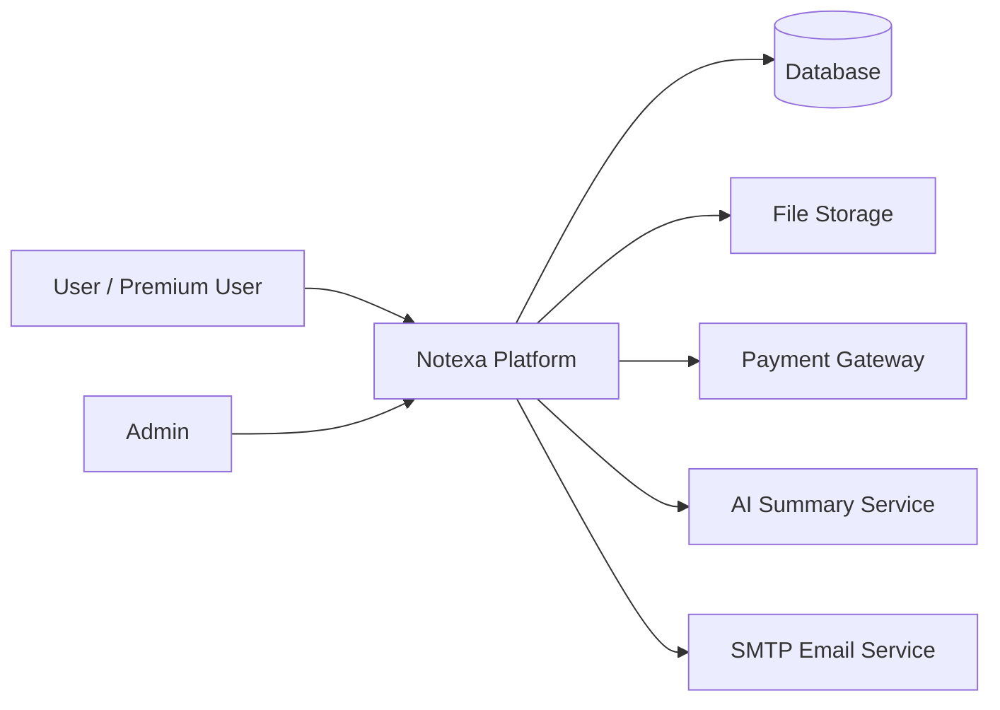

### 23.11 Level 1 DFD

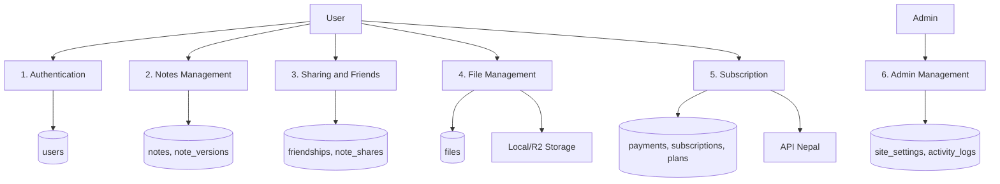

### 23.12 Module Breakdown

| Module | Backend | Frontend | Flutter |
| --- | --- | --- | --- |
| Authentication | `AuthController`, `User` | Login/register pages, auth store | Login/register screens, `AuthService` |
| Notes | `NoteController`, `Note` | Dashboard notes, note detail, TipTap editor | Notes list and editor screens |
| Sharing | `NoteShareController`, `NoteShare` | Share modal, shared page | Shared screen and editor sharing |
| Friends | `FriendController`, `Friendship` | Friends dashboard page | Friends screen |
| Files | `FileController`, `File`, `R2StorageService` | Files page, note attachments | Files screen, PDF viewer |
| Subscription | `SubscriptionController`, plans/payments | Subscription page | API-ready, not full subscription UI |
| Admin | `AdminController` | Admin dashboard/pages | Not implemented for mobile |
| AI Summary | `DeepSeekService` | AI summary action in note page | AI summary action in note editor |
| Settings | `SiteSetting`, `AdminController` | Admin settings page | API settings not editable on mobile |

### 23.13 Project Methodology

The project follows an iterative development approach:

1. Design database and backend API.
2. Implement authentication and user model.
3. Implement note CRUD and note status features.
4. Implement sharing and friend modules.
5. Implement file upload and storage services.
6. Implement subscription and payment integration.
7. Build Next.js frontend pages and API integration.
8. Build Flutter mobile app with local storage and sync.
9. Add admin dashboard and settings.
10. Test workflows manually and prepare documentation.

### 23.14 Risk Analysis

| Risk | Impact | Mitigation |
| --- | --- | --- |
| Wrong API URL in frontend/mobile | Network errors | Use environment variables and production URL checks |
| Payment gateway failure | Subscription not activated | Store pending payment and validate IPN/status |
| File storage misconfiguration | Upload/download failure | Fallback to local storage and admin settings checks |
| Exposed secrets | Security issue | Keep secrets in `.env` or settings only |
| Missing CORS restrictions | Security/config issue | Restrict origins in production |
| Mobile offline conflicts | Duplicate/outdated notes | Dirty-note sync and ID replacement logic |
| Insufficient test coverage | Regression risk | Add backend, frontend, and Flutter automated tests |

### 23.15 Maintenance Plan

- Regularly update Composer, npm, and Flutter dependencies.
- Monitor Laravel logs for API errors.
- Monitor frontend build output after dependency upgrades.
- Backup database and uploaded files.
- Rotate API keys and SMTP credentials when needed.
- Review admin users periodically.
- Add automated tests before major feature changes.
- Keep deployment environment variables documented and secure.

### 23.16 Viva Preparation Points

Important points to explain during project viva:

- Why Laravel Sanctum was selected for API token authentication.
- How note permissions are checked for owners and collaborators.
- How friend-based sharing is different from share-code sharing.
- How file upload checks storage quota.
- How mobile local notes work before login.
- How local notes sync after login.
- How admin settings make integrations configurable.
- How Tailwind CSS 4 is configured in the Next.js frontend.
- Why the Flutter production API URL must point to the deployed Laravel API.
- What improvements can be added in future, such as real-time collaboration.

---

## 24. Conclusion

Notexa is a complete minor-project-level full-stack application that demonstrates modern software development across backend, web, and mobile platforms. The Laravel backend provides secure APIs, database design, file storage, payment processing, AI integration, and admin control. The Next.js frontend provides a polished browser-based user and admin experience with rich note editing. The Flutter app extends the platform to mobile users and adds offline/local note functionality with cloud synchronization.

Together, these three stacks form a practical collaborative note-taking ecosystem that is suitable for academic demonstration, viva explanation, and future production enhancement.

---

## 25. Glossary

| Term | Meaning |
| --- | --- |
| API | Application Programming Interface |
| Sanctum | Laravel package for API token authentication |
| Token | Secret string used to authenticate API requests |
| CRUD | Create, Read, Update, Delete |
| R2 | Cloudflare object storage compatible with S3-style APIs |
| S3 | Object storage API commonly used for files |
| IPN | Instant Payment Notification from payment gateway |
| SMTP | Protocol used to send email |
| AI Summary | Automatically generated short summary of note content |
| Share Code | Unique code used to access a shared note |
| Permission | Access level such as view or edit |
| Offline Sync | Saving locally first and uploading to cloud later |
